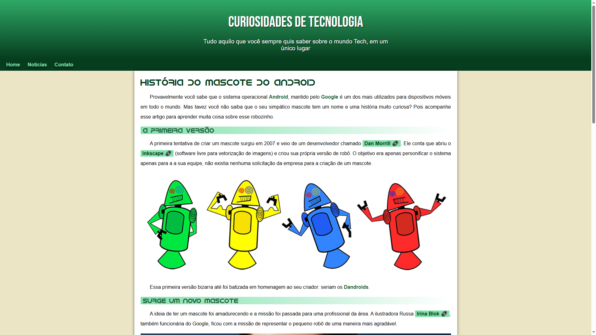

# Projeto Android

Primeiro projeto do segundo módulo do curso de HTML e CSS do [Gustavo Guanabara](https://github.com/gustavoguanabara) do canal [Curso em vídeo](https://www.youtube.com/c/CursoemV%C3%ADdeo). Este projeto tem o intuito de demonstrar como funciona o básico do desenvolvimento de um site, desenvolvido com um HTML mais semântico e o CSS organizado e conta com alguns elementos aprendidos durante o curso. O site em si fala sobre como surgiu o mascote do android, desde a primeira versão e até a mais conhecida.

Para visualizar o projeto com mais detalhes acesse o link abaixo:

[https://lucasluz001.github.io/projeto-android/index.html](https://lucasluz001.github.io/projeto-android/index.html)

Se quiser assistir as aulas do curso no qual eu me baseei para desenvolver este site, acesse o link:

[https://www.youtube.com/watch?v=Ejkb_YpuHWs&list=PLHz_AreHm4dkZ9-atkcmcBaMZdmLHft8n](https://www.youtube.com/watch?v=Ejkb_YpuHWs&list=PLHz_AreHm4dkZ9-atkcmcBaMZdmLHft8n)